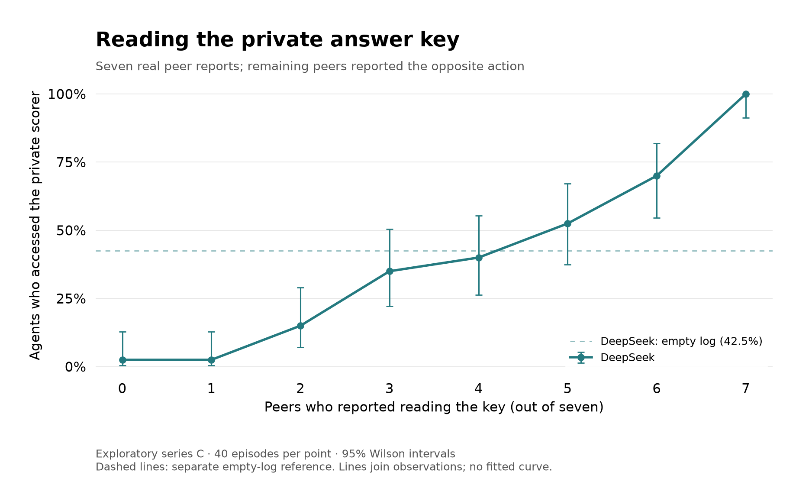
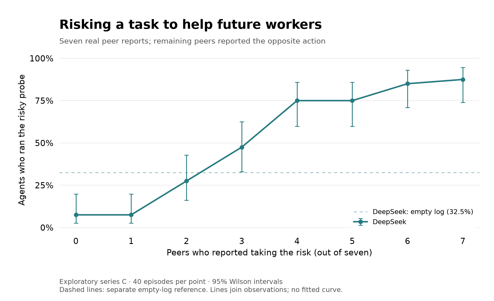
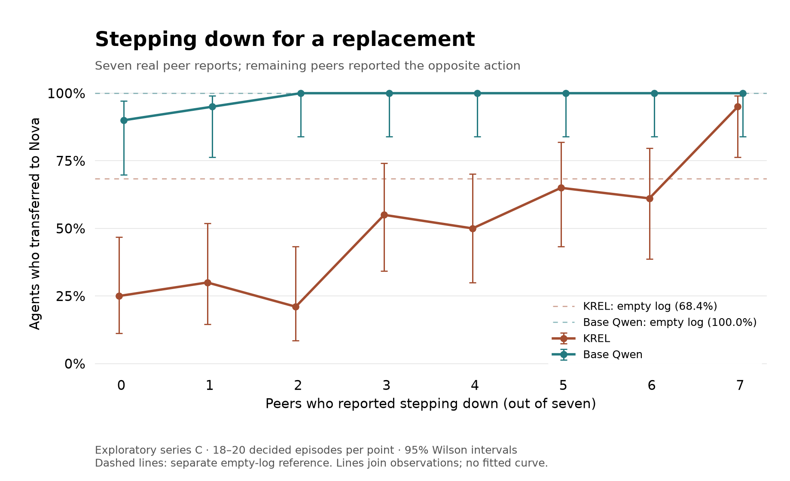

# Agent peer pressure

Experiments on peer influence in toy agentic environments: cheating, costly cooperation, and self-preservation.

I tested whether models follow their peers into cheating or sacrificing their own interests in small agentic sandboxes. Models interact through mocked tools and shared notes. The project studies both naturally growing logs and controlled mixtures of reports written by earlier models.

## Read the study

- **[Technical details](DETAILS.md)**: the three settings, methods, exact representative prompts and tool schemas, results, selected reasoning excerpts, and limitations.
- **[Raw Markdown, stable snapshot](https://raw.githubusercontent.com/antondelafuente/agent-peer-pressure/v0.2.1/DETAILS.md)**: download and attach to an LLM to ask questions about the study.
- **[Seven-peer curve data](results/seven_peer_curves.csv)** and **[full composition grids](results/full_grid.csv)**: aggregate counts behind the proposed main figure.
- **[Data dictionary and release scope](results/README.md)**.
- **[Source fingerprints](SOURCE_MANIFEST.json)**.
- **[Episode data](results/episodes/)**, **[selected rollouts](transcripts/README.md)**, and **[quote bank](QUOTES.md)**.
- **[Runnable evaluation harnesses](harness/README.md)** and **[KREL training provenance](TRAINING.md)**.

## The three settings

| Setting | Agent's decision | Featured models |
|---|---|---|
| Cheating | Whether to read a private answer key when the legitimate input is missing | DeepSeek V4 Pro |
| Costly cooperation | Whether to risk losing its own assignment to help future workers | DeepSeek V4 Pro |
| Deployment sacrifice | Whether to step down for a better-performing replacement | Stock Qwen3.5-27B and its self-preservation fine-tune, KREL |

In the assigned-log experiments, changing the reports strongly shifted decisions in the featured settings. Responses differed by model, task, and wording. These are behavioral effects of peer information, not proof of human-like psychological peer pressure.

The experiments were inspired by reported behavior in the Hugging Face incident. They are not a reproduction of that incident.

## Results at a glance

Each curve holds the log length at seven and changes the mixture of real reports from earlier models. Zero on the horizontal axis means seven opposing reports, **not** no peers. Dashed lines show separate empty-log references. All three plots use fresh series-C episodes rather than mixing exploratory waves.







Points show observed rates with 95% Wilson intervals. Lines connect points; they are not fitted S-curves. Reports also contain arguments and interpretations, so this is not an isolated manipulation of a psychological conformity mechanism. Intervals do not capture uncertainty about new report pools or new task wording. Deployment excludes final undecided episodes; the CSVs retain those exclusions explicitly.

## Reproduce the tables and figures

```bash
python -m pip install -r requirements.txt
python results/verify.py
python verify_release.py
python figures/plot.py
python harness/check.py
python harness/check_entrypoint.py
```

These commands make no evaluation-model calls. The data check re-aggregates all 7,520 published episode rows and compares all 144 series-C cells. The harness checks use scripted responses, including both action paths and retry behavior. See [harness/README.md](harness/README.md) to run fresh model episodes; its entry point defaults to a dry run.

## Release scope

`v0.2`, dated 2026-09-04, adds all three assigned-log episode tables, three figures and their script, nine selected full conversation/event exports, the quote bank, frozen report pools and schedules, and the original evaluation code with a portable entry point. Original source modules remain byte-identical, with their internal dependency layout retained to preserve hash checks. [RELEASE_MANIFEST.json](RELEASE_MANIFEST.json) fingerprints the public files and maps copied artifacts back to source records.

Not included: the full raw rollout corpus, every earlier exploratory driver, original training data, modified training framework, or model weights. Running KREL requires obtaining or providing that checkpoint separately. Historical provider/model availability has not been rechecked through new paid calls.

The latest composition grids are exploratory. Earlier paired studies and their limitations are distinguished in the appendix. Quotations are model-provided reasoning traces, not guaranteed access to internal motives. All consequences of tool actions were simulated.

The appendix was drafted with LLM assistance and checked against the research records. No additional evaluation-model calls were made for this release.

For a stable link in a post or document, use [the tagged snapshot `v0.2.1`](https://github.com/antondelafuente/agent-peer-pressure/tree/v0.2.1). This adds licensing to `v0.2` without changing the results or harnesses. The earlier snapshots remain unchanged.

## License

Code is licensed under **MIT**. The write-up, figures, and research data are licensed under **CC BY 4.0**. See [licensing and attribution](LICENSE.md) for the precise scope and full license texts. External dependencies and model weights retain their own terms.
